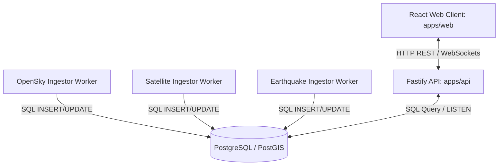
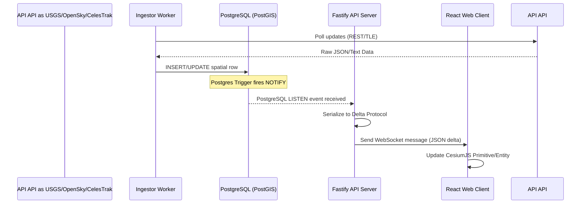

# System Architecture

This document describes the technical architecture of the **Q-Sight Command Center**.

---

## 1. System Overview

The Q-Sight system is structured as a decoupled monorepo composed of a React web client, a Fastify API server, and multiple isolated background workers that ingest live telemetry. All elements communicate through a shared PostGIS database and real-time WebSockets.

---

## 2. Component Architecture

### Frontend Architecture (`apps/web`)
*   **Framework**: React (Vite-powered Single Page Application) + TypeScript.
*   **Geospatial Visualization**: CesiumJS for rendering the 3D globe, integrated with Google Photorealistic 3D Tiles.
*   **Styling**: Vanilla CSS. Standardizes a high-contrast dark theme optimized for low-fatigue operations control centers.
*   **State Management**: React hooks for telemetry cache and lifecycle management:
    *   `useDashboardData.ts`: Centralizes state for all telemetry layers, connectivity status, data source mapping, and the operational timeline generator. Preserves stale data on backend failures.
    *   `usePolling.ts`: Manages configurable safe polling intervals, countdown timer ticks, play/pause controls, and manual refreshes.
    *   `formatting.ts`: Decoupled unit formatting and UTC timestamp standardization.

### Backend Architecture (`apps/api`)
*   **Framework**: Fastify + TypeScript. Fastify is chosen for its low overhead, speed, and native JSON schema validation.
*   **Authentication & RBAC**:
    *   `context.ts`: Extracts simulated roles (`x-q-sight-role`), user identifiers (`x-q-sight-user-id`), and request correlation IDs (`x-q-sight-request-id`) from HTTP headers. Note: `x-q-sight-role` and similar developer headers are development-only and must be ignored/rejected when `BUILD_PROFILE=production`.
    *   `roles.ts`: Declares role mappings (`operator`, `supervisor`, `auditor`, `admin`) to granular permissions.
    *   `requirePermission.ts`: Protects routes dynamically. Returns `403 Forbidden` if permissions are insufficient and logs rate-limited denials.
*   **Database Interface**: Knex.js / node-postgres querying a PostGIS database. Calls dev migrations (`runDevMigrations()`) on start to verify the schema.
*   **Real-time Server**: `fastify-websocket` managing operator client connections.
*   **Pub/Sub**: PostgreSQL `LISTEN/NOTIFY` channels are used to capture updates from background workers and push them down WebSockets immediately.

### Worker Architecture (`workers/*`)
*   **Framework**: NodeJS + TypeScript.
*   **Ingestion Pattern**: Workers run programmatically to fetch telemetry. In v0.7, workers utilize a cautious adapter architecture:
    *   **Opt-in Live Feeds**: Configured via `.env` variables (`LIVE_INGESTION_ENABLED`, `AIRCRAFT_LIVE_ENABLED`, etc.). Default mode remains mock.
    *   **Shared Ingestion Types**: Common Zod validation and output formatting (`IngestionResult<T>`) reside in `@q-sight/shared`.
    *   **Defensive HTTP Client**: Custom fetch handler (`fetchWithTimeout`) implements strict request abort timeouts to avoid hanging.
    *   **Resilient Fallback**: Mock/demo fallback is allowed only in demo/local profiles and is disabled in production-like mode. Production-like behavior must fail closed, use last-known-good trusted data, or mark source quality as degraded/stale/expired. Simulated data must never enter production databases.
    *   **Write Separation**: Database persistence is optional and guarded by `LIVE_INGESTOR_WRITE_TO_DB`. If disabled, data is processed in-memory without writes.
*   **Rate Limits**: Configured intervals (`INGESTION_INTERVAL_*_MS`) prevent workers from overloading APIs.

---

## 3. PostGIS Data Model
PostgreSQL with the PostGIS extension is used to store and index geospatial entities.

*   `aircraft_positions`: Tracks latitude, longitude, and altitude of aircraft. Uses a 3D Point (`POINTZ`) geometry with GIST spatial indexing.
*   `satellite_orbits`: Stores orbit footprints. Uses a Polygon (`POLYGON`) geometry representing the satellite's signal range on the ground.
*   `seismic_events`: Stores USGS earthquake coordinates (`POINT`) along with magnitude and time.
*   `sensor_registry`: Stores sensors (`POINT`) along with status and owner verification keys.
*   `audit_logs`: Append-only logs capturing user access records to sensor metadata.

*Note: For complete table details, see [database-schema.md](file:///d:/Q-Sight%20Command%20Center/docs/database-schema.md).*

---

## 4. WebSocket Update Flow
To maintain sub-second updates without polling, data updates flow asynchronously from workers to the client.

---

## 5. Deployment Architecture

### Local Development
Orchestrated entirely via `docker-compose.yml` in the `infra` folder, providing:
*   A pre-configured PostGIS container.
*   Automated setup scripts running on port `5432`.

### Production Deployment
*   **Services**: Node processes containerized using Docker.
*   **Deployment**: Can be orchestrated using Kubernetes (K8s) or cloud platforms.
*   **Database**: Managed Postgres instance with PostGIS enabled (e.g., AWS RDS PostgreSQL).
