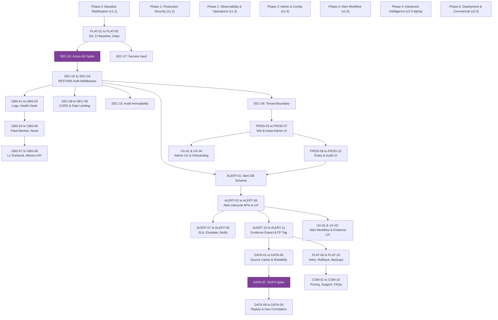

# Roadmap Dependency Map

This document outlines the release sequence, technical blockages, parallelization options, and key decision triggers across the Q-Sight productization lifecycle.

---

## 1. Release Dependency Graph

The Mermaid diagram below visualizes the execution sequence. Phase 0 is the prerequisite for all coding work. Phase 1 unlocks the core backend and frontend security layers, which are prerequisites for the administrative interfaces, alerting workflows, and deployment setups.

---

## 2. Epics Blocking Staging & Production Releases (P0 Blockers)

These epics must be fully implemented, tested, and audited before the platform can transition out of a simulated staging environment:

1. **SEC-01 (Azure AD Spike) & SEC-02 (Frontend Login)**: Block all user-facing access. Simulated headers (`x-q-sight-role`) represent a critical exploit vector.
2. **SEC-03 (REST JWT Middleware) & SEC-04 (WebSocket Auth Handshake)**: Block backend deployment. Without these, the API accepts unauthorized data queries and WebSocket telemetry subscriptions.
3. **SEC-06 (Tenant/Org Isolation)**: Blocks multi-tenant enterprise pilots. Tenancy isolation middleware must be implemented at the router level.
4. **PLAT-01 (Git Branching) & PLAT-02 (CI Pipeline)**: Block active multi-developer sprints. Code stabilization cannot be maintained manually.
5. **PLAT-06 (Migration Strategy)**: Blocks database updates. Schema evolution must be automated and backward-compatible.

---

## 3. Parallel Workstream Analysis

Once Phase 1 (Security Foundation) is deployed, engineering tasks can split into three parallel workstreams to optimize delivery speed:

*   **Workstream A: Core Operations & Alerting (Backend + UX)**
    *   *Epics*: ALERT-01 to ALERT-11, UX-02, UX-03.
    *   *Focus*: Building persistent database alert tables, state-transition REST controllers, and operator alert management dashboards.
*   **Workstream B: Administration & Tenant Controls (Frontend + API)**
    *   *Epics*: PROD-01 to PROD-10, UX-01.
    *   *Focus*: Developing site, asset, and camera CRUD interfaces and restricting configurations to Supervisor/Admin roles.
*   **Workstream C: Infrastructure, Observability & Platform (DevOps)**
    *   *Epics*: OBS-01 to OBS-08, PLAT-07 to PLAT-10.
    *   *Focus*: Centralizing logs, setting up Prometheus metric exporters, writing backup/restore bash/powershell tasks, and drafting staging verification gates.

---

## 4. Key Technical Spikes and Decision Points

The team must execute the following spikes and capture administrative decisions before Phase 3 and Phase 5 engineering:

*   **SEC-01 (Azure AD Integration Spike)**: 
    *   *Objective*: Verify OIDC discovery endpoints, configure client redirection configurations in Azure Portal, and confirm scope-mapping to internal database roles.
    *   *Trigger*: Blocks Phase 1 start.
*   **DATA-07 (SGP4 Orbital Propagation Spike)**:
    *   *Objective*: Benchmarking the CPU overhead of running satellite.js in Node worker processes vs. client-side JS rendering.
    *   *Trigger*: Blocks Phase 5 (Advanced Intelligence).
*   **D-03 Revisit (Docker Compose vs. Kubernetes)**:
    *   *Objective*: Operational review of pilot scale. If a customer demands deployment across a clustered environment rather than a single virtual machine, we must pivot from Docker Compose to Helm-managed Kubernetes.
    *   *Trigger*: Standard exit gate of Phase 5.
