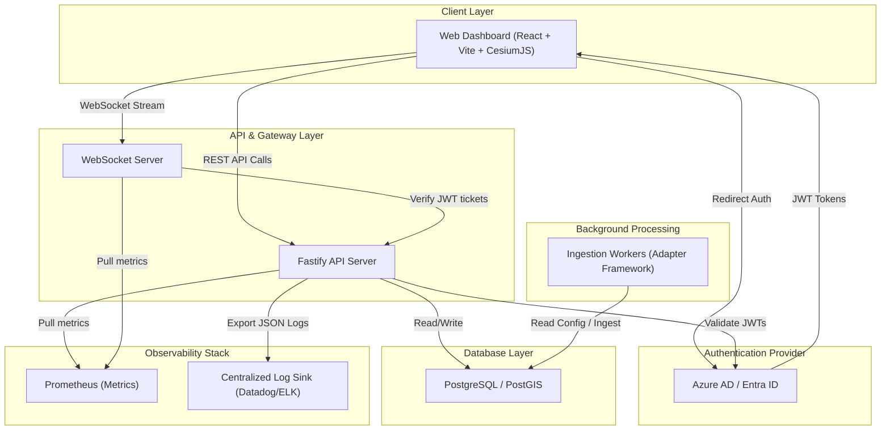
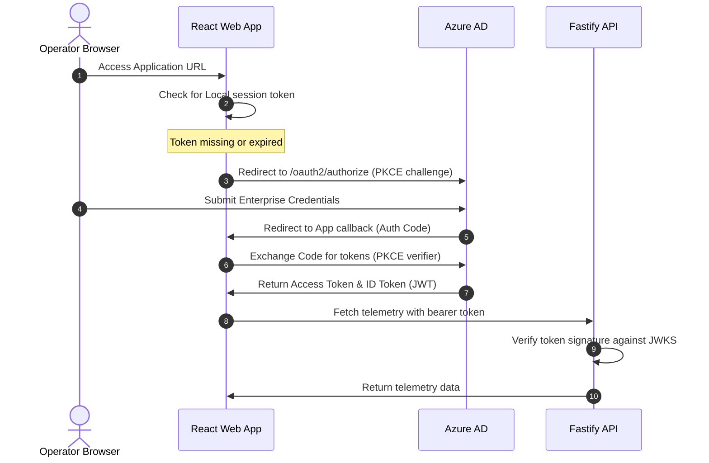
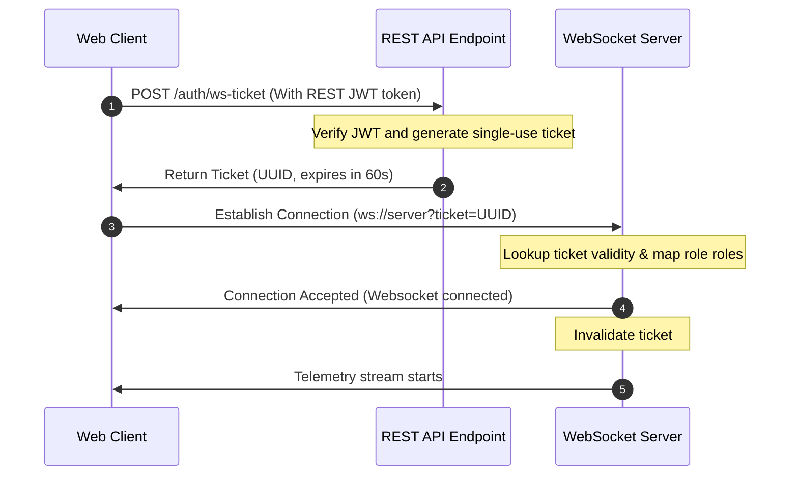
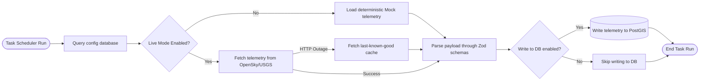
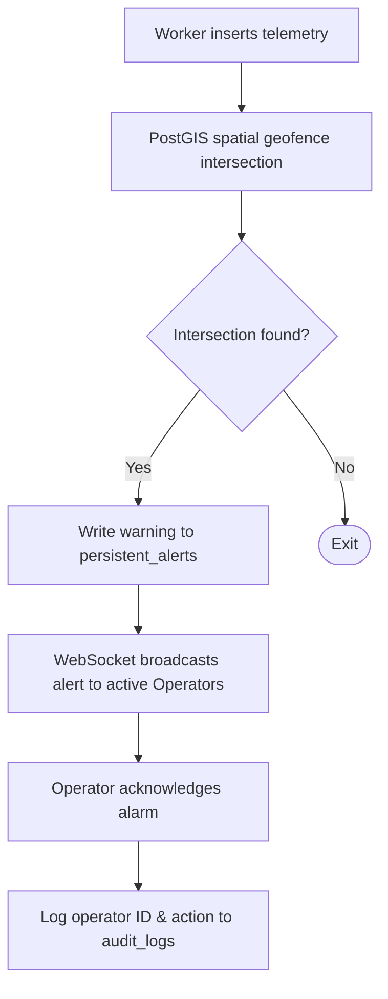

# Target Architecture

This document describes the target-state architecture of the Q-Sight Command Center (v2.0), illustrating authentication, real-time message delivery, data ingestion pipelines, and observability.

---

## 1. System Component Block Diagram

---

## 2. Authentication Flow

Authentication uses the OpenID Connect (OIDC) authorization code flow with PKCE, managed via Azure AD.

---

## 3. WebSocket Handshake & Authentication

Because browsers do not support custom authorization headers in standard WebSocket connections, Q-Sight implements a **Single-Use Pre-Authentication Ticket** pattern.

---

## 4. Ingestion Worker Pipeline

Background tasks execute on a non-overlapping scheduling interval, verifying database configuration tables before connecting to external data APIs.

---

## 5. Alert Lifecycle Workflow

Alerts are processed spatially in PostGIS and pushed to clients in real-time.

---

## 6. Infrastructure Operations Model

### A. Observability Model
*   **Structured Logs**: Fastify and worker processes write structured logs to `stdout` in JSON format. A log shipper (e.g., Filebeat or Datadog Agent) parses these logs and routes them to a centralized SIEM platform.
*   **Performance Metrics**: Exporters expose standard performance counters (CPU, RAM, API request counts, WebSocket connection counts) in Prometheus format on port `9090/metrics`.

### B. Backup & Recovery Model
*   **Database Archiving**: A cron job triggers `pg_dump` daily, saving SQL backups to a local storage mount.
*   **Staging Replication**: Staging databases can be restored by running target recovery scripts against these compressed SQL files.
